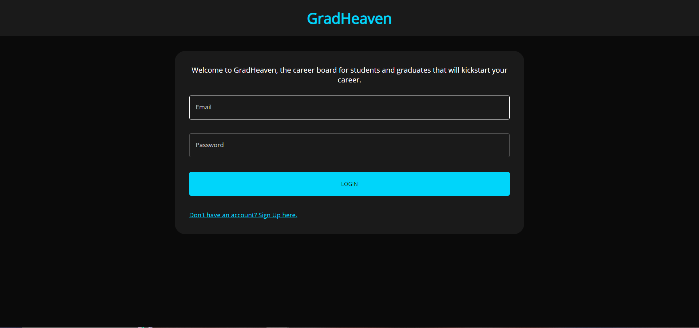
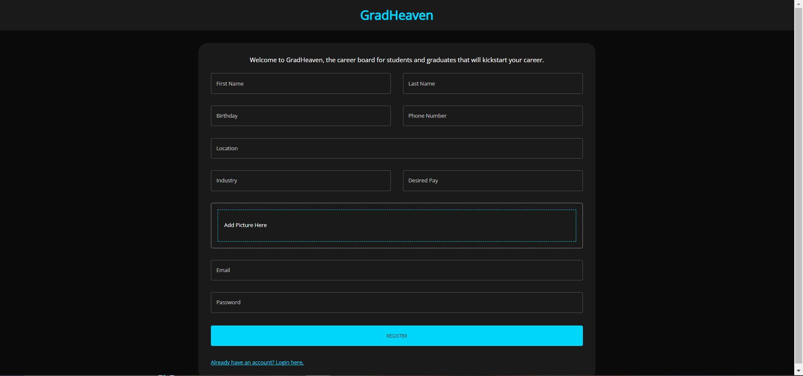
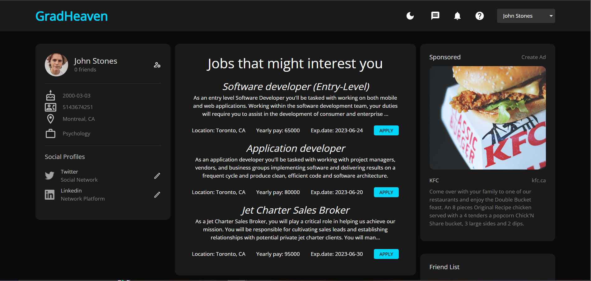
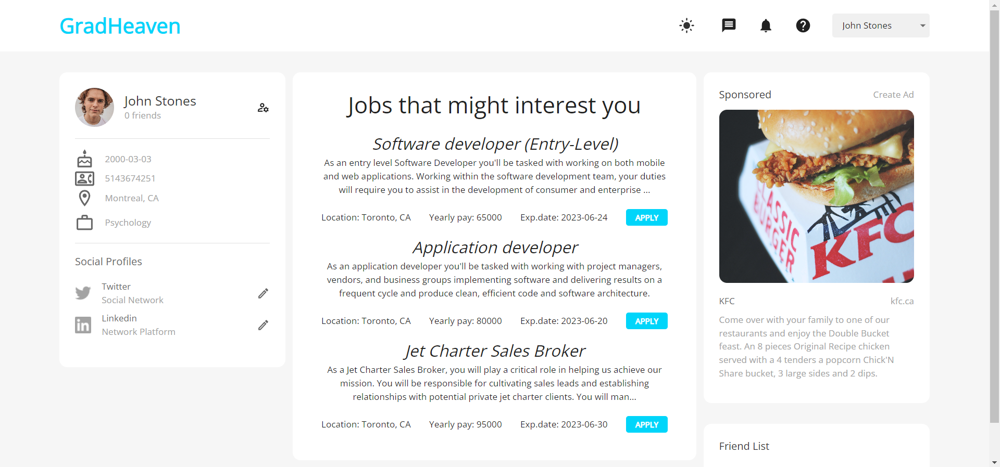

# GradHeavenWeb

## What is GradHeaven ?
#### GradHeaven is a job board that is exclusive to students and graduates. The competition is ruthless when finding a job fresh out of college, especially with people with years of experience over you. This application will display internship, COOP, bridging programs and permanent job opportunities to kickstart this young generation's career.

## About the web version
#### This repo holds the source code of the web version of the application. It is a MERN fullstack application that uses Redux. Jobs, USers, Companies, resumes and cover letters stored in MongoDB.

## A peak of what it looks like as of right now.

